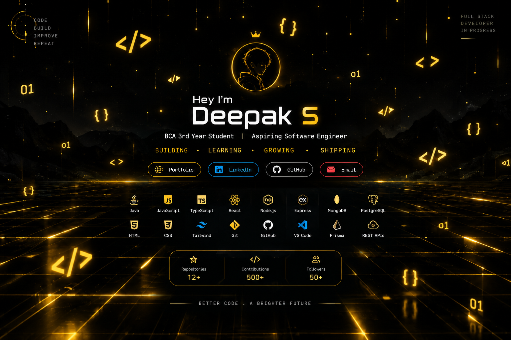

<div align="center">



<br/>


<br/>

<a href="https://deepak-portfolio-06.vercel.app/">

</a>

<a href="https://www.linkedin.com/in/deepak-s1006/">

</a>

<a href="https://github.com/Deepak-1006S">

</a>

<a href="mailto:deepak1006.dev@gmail.com">

</a>

</div>

---

## ⚡ `whoami`

```javascript
const deepak = {
    name: "Deepak S",
    education: "BCA — 3rd Year",
    role: "Aspiring Software Engineer",

    focus: [
        "Full-Stack Development",
        "Backend Development",
        "Data Structures & Algorithms",
        "AI Integration"
    ],

    stack: [
        "Java",
        "JavaScript",
        "TypeScript",
        "React",
        "Node.js",
        "Express",
        "MongoDB",
        "PostgreSQL"
    ],

    philosophy:
        "Build. Break. Learn. Improve. Repeat."
};
```

---

<div align="center">

## 🧠 `TECH STACK`


</div>

---

## 🚀 `FEATURED PROJECTS`

### 🤖 CodeForge AI

AI-powered software engineering workspace for developers.

**Tech:** React • TypeScript • Node.js • Express • AI • Prisma

### 🚆 Railway-X

Full-stack railway management application with real-world CRUD workflows.

**Tech:** React • Node.js • Express • MongoDB • REST API

### 🎯 Interview-Ace AI

AI-powered interview preparation platform.

**Tech:** React • AI • TypeScript

### 🔄 FlowSync

Real-time collaboration platform.

**Tech:** React • Node.js • Socket.IO

### 🏪 Enterprise Store Management

Full-stack store management application.

**Tech:** React • Node.js • Express • Database

### 💰 Accounting System

Full-stack accounting management platform.

**Tech:** React • Node.js • REST API • Database

---

<div align="center">

## 💻 `GITHUB ACTIVITY`


<br/>


<br/>


</div>

---

## 💼 `EXPERIENCE`

### 🟡 Gradtwin — Java Full-Stack Developer Intern

`Jul 2026 – Sep 2026`

* Java & OOP
* DSA & problem solving
* Backend development fundamentals
* Software development practices

### 🔵 VIPS.Tech — Full Stack Development Intern

`May 2026 – Jun 2026`

* React.js
* Node.js
* Express.js
* MongoDB
* REST APIs
* JWT Authentication
* CRUD
* Git & GitHub

### 🟣 VIPS.Tech — AI & ML Intern

`May 2025 – Jun 2025`

* Data preprocessing
* Model evaluation
* AI/ML workflows

---

<div align="center">

## 🔥 `CURRENTLY LEARNING`


</div>

---

## 📜 `CERTIFICATIONS`

* 🏆 HackerRank Software Engineer
* 🧠 Problem Solving Intermediate
* ☕ Java Basic
* 🟨 JavaScript Intermediate
* 🗄️ SQL Advanced
* 🟢 Node.js Intermediate
* ⚛️ React Basic
* 🔗 REST API Intermediate
* 🍃 MongoDB Basics
* 🤖 AI & ML
* ☕ NPTEL Java

---

<div align="center">

## 🌐 `LET'S CONNECT`

<a href="https://deepak-portfolio-06.vercel.app/">

</a>

<a href="https://www.linkedin.com/in/deepak-s1006/">

</a>

<a href="https://github.com/Deepak-1006S">

</a>

<br/><br/>


<br/><br/>


</div>
